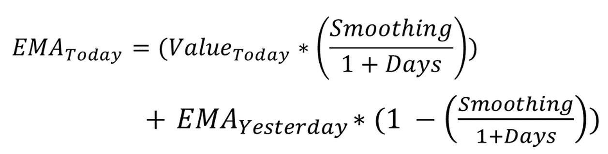
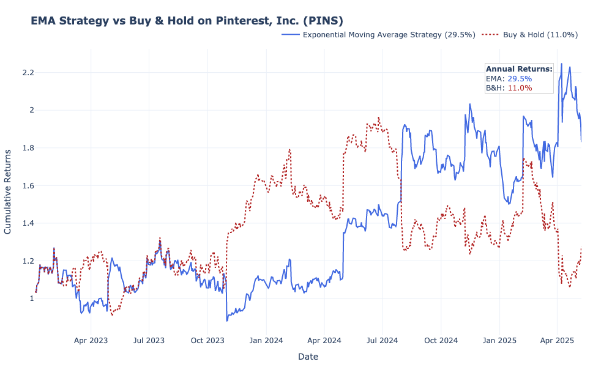
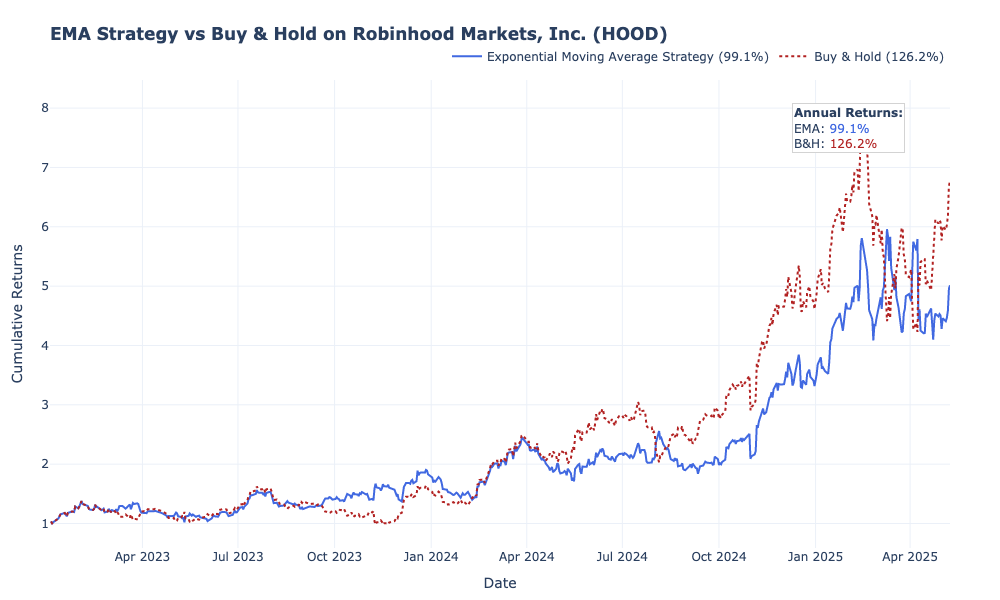

##  Goal

Build a simple trading strategy based on the crossover of exponential moving averages (EMA), compare its performance against a Buy & Hold strategy, and provide a visual analysis of the results.

The main advantage of the **Exponential Moving Average (EMA)** over the **Simple Moving Average (SMA)** is that **EMA gives more weight to recent prices**, making it more responsive to new information and short-term market movements

---
## Technologies Used

- **Language:** Python 3.10+
- **Libraries:**
  - `pandas` 
  - `numpy` 
  - `yfinance` 
  - `plotly` 

---
##  What the Project Does

- Downloads historical stock data for **PINS** using `yfinance`
- Calculates two exponential moving averages:
  - EMA12 (short-term)
  - EMA26 (long-term)
- Generates trading signals:
  - **Buy(1)**  when EMA12 above EMA26
  - **Sell(-1)** when EMA12 below EMA26
- Computes cumulative returns of the EMA strategy
- Compares it with a basic Buy & Hold strategy
---

## Plot

and that's when the EMA looks lose relative to B&H:

